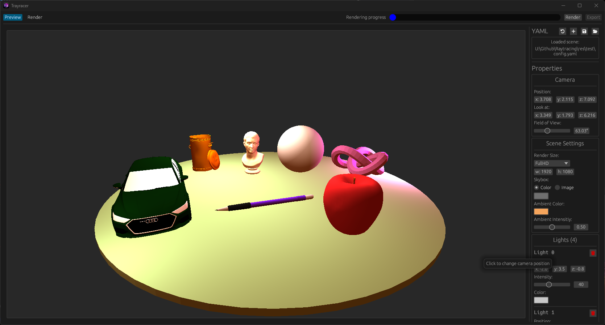

[](https://github.com/bircni/Raytracing/actions/workflows/ci.yml)
[](https://github.com/bircni/Raytracing/blob/main/LICENSE)

<!-- [](https://crates.io/crates/trayracer)
[](https://docs.rs/trayracer) -->

# Trayracer - Raytracing

This is the main repository for the raytracing project.

<div align="center">


</div>

## Usage

Feel free to download the latest release from [releases](https://github.com/bircni/Raytracing/releases) or build it yourself.

### Build

**Requirements**:

- Rust <https://www.rust-lang.org/tools/install>

Build with:

```bash
cargo build --release
```

and run with:

```bash
cargo run --release
```

## Documentation

You can find the generated rust documentation [here](http://bircni.me/Raytracing) and the wiki
[here](https://github.com/bircni/Raytracing/wiki).

## License

Distributed under the GNU General Public License v3.0. See `LICENSE` for more information.

## Contributing

To contribute to this project, please read the [Contributing Guidelines](./CONTRIBUTING.md).

## Translations

Available translations:

- English
- German

If you want to contribute a translation, create a new `.yaml` file in the `locales` folder and add the translations.

## Contributors

<p align="center">
<a href="https://github.com/bircni/Raytracing/graphs/contributors">
  
</a>
</p>
